# Leili Codex Skin

一个面向 macOS Codex 桌面端的本地主题中心。可以浏览、应用、验证、恢复和自制主题，并在 GitHub 发布新主题后自动提示更新。

> 非官方项目，与 OpenAI 无隶属、赞助或背书关系。不会修改官方 `app.asar`，主题通过本机回环接口临时应用，可随时恢复官方界面。

## APP 预览

| 中文界面 | English UI |
|---|---|
| 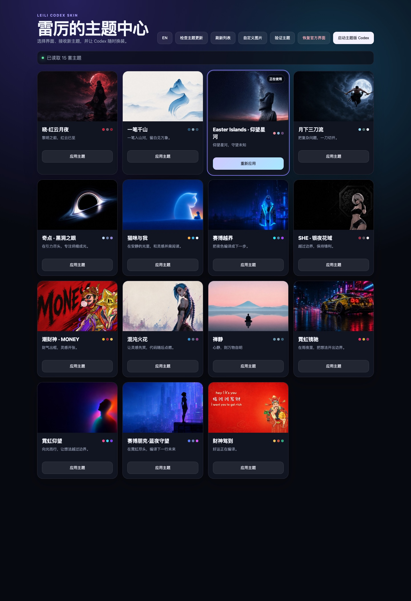 | 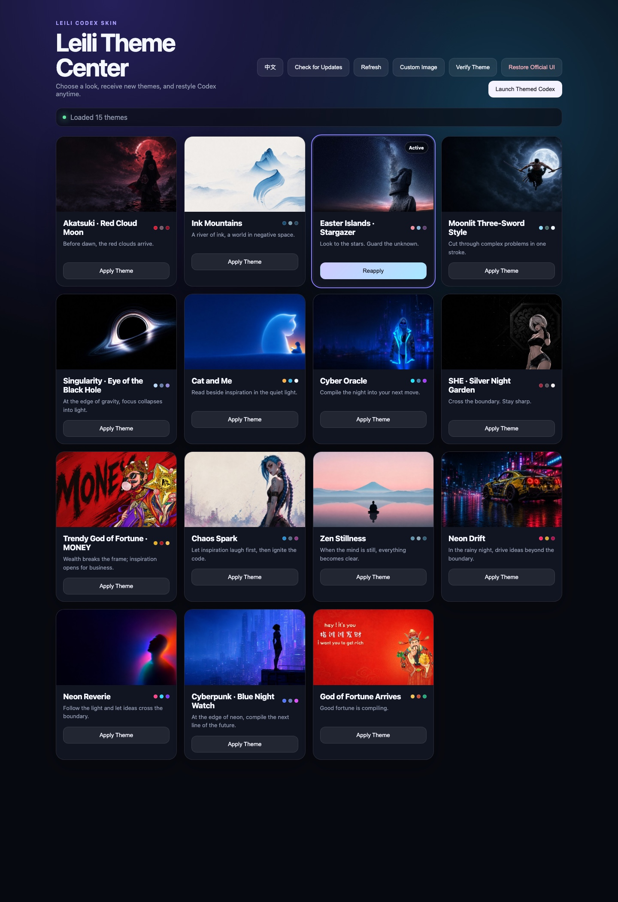 |

APP 会自动跟随 macOS 系统语言，也可以随时点击顶部的 `中文 / EN` 按钮切换。

### 1.2.7 动画特色

`1.2.7` 为多数主题加入与人物、车辆、黑洞或静物相匹配的右上角循环动态伙伴，并针对主题内容分别设计动作：

- 人物不再整体上下漂浮，也不在背后播放扫光。晓会做披风式起势，Chaos Spark 有侧身小动作，读书猫低头阅读，Cyber Oracle 抬头观察，财神作揖、潮财神招手，梅西亲吻奖杯，三刀流挥刀，SHE 轻微调整姿态。
- Easter Islands 石像会缓慢抬头、低头；Zen 以冥想呼吸配合扩散涟漪；Claude 像素宠物会眨眼和迈步。
- 奇点黑洞本体保持稳定，仅让高光沿事件视界持续环绕；霓虹镜驰保留完整车身，并加入轻微引擎振动和速度线。
- 所有动作均自动循环，并支持 macOS“减少动态效果”设置。模型档位拉条的轨道、圆点和滑块也会自动匹配当前主题配色。
- 一笔千山、霓虹仰望和赛博朋克·蓝夜守望按设计保持无宠物。

动态伙伴属于新版运行引擎。要获得完整效果，请重新下载并安装 `1.2.7` APP；只更新主题包不会升级旧引擎。

`1.2.3` 新增 **Claude 原生** 暖白主题：包含本机 Token 活动热力图、`All / 30d / 7d` 区间切换、每日悬停详情与动态像素宠物。统计只在皮肤启动或重新应用时读取，不上传会话内容；公开预览使用示例数据。

`1.2.2` 新增 2560×1440 等高屏窗口适配：主题横幅会随可用高度平滑扩展，卡片和输入框保持在主要视觉区域；1080p 与紧凑窗口布局保持不变。

## 主题实际效果

以下均为 Codex 实际运行界面截取。截图时侧边栏已在 Codex 内真实折叠，并已检查不包含私人对话、项目名称或文件路径。APP 下载包内共含 17 套主题，公开图库展示其中 16 套；Claude 原生的统计预览使用明确标注的示例数据。

| 晓·红云月夜 | 一笔千山 |
|---|---|
| 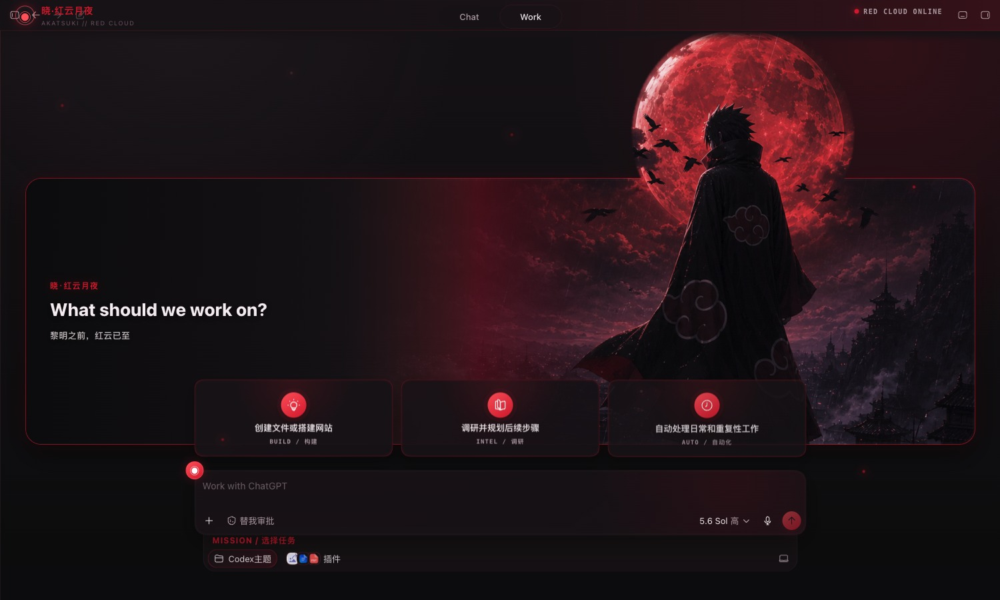 |  |

| 混沌火花 / Chaos Spark | 猫咪与我 / Cat and Me |
|---|---|
| 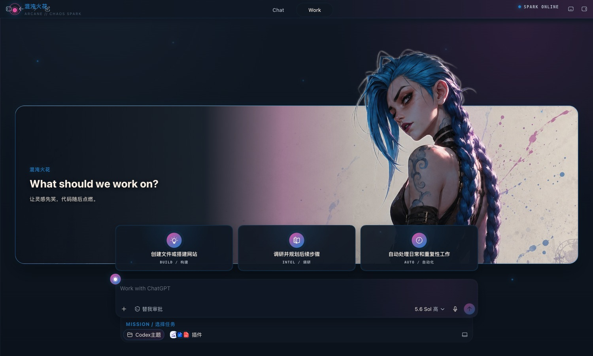 | 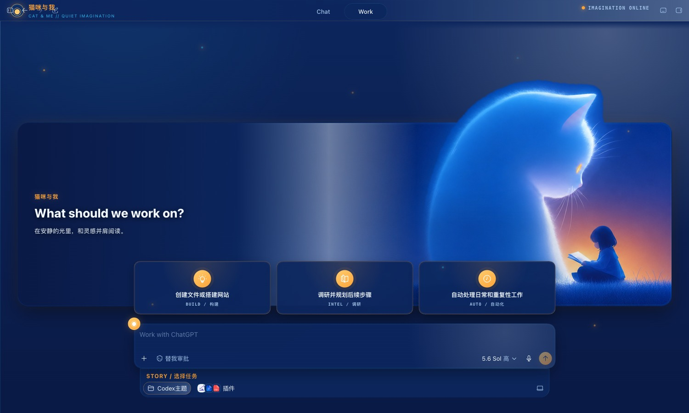 |

| 赛博越界 / Cyber Oracle | 赛博朋克·蓝夜守望 / Cyberpunk Blue Night Watch |
|---|---|
| 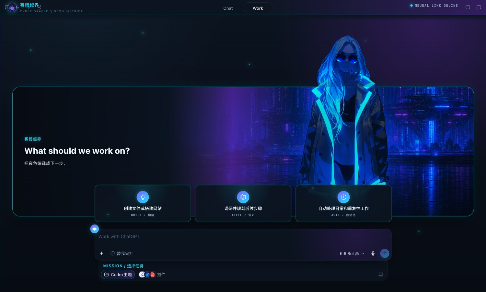 | 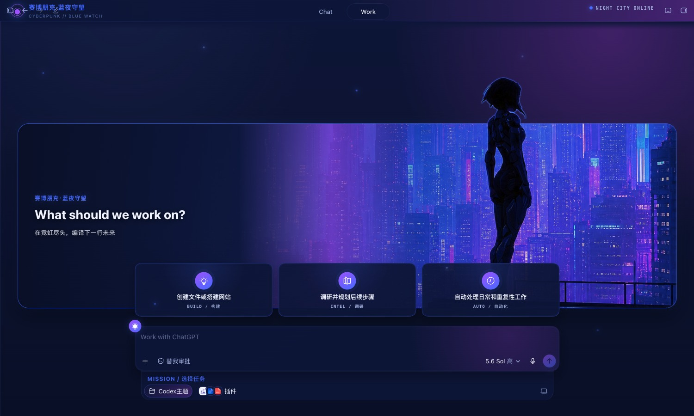 |

| Easter Islands · 仰望星河 | 奇点 · 黑洞之眼 / Singularity |
|---|---|
| 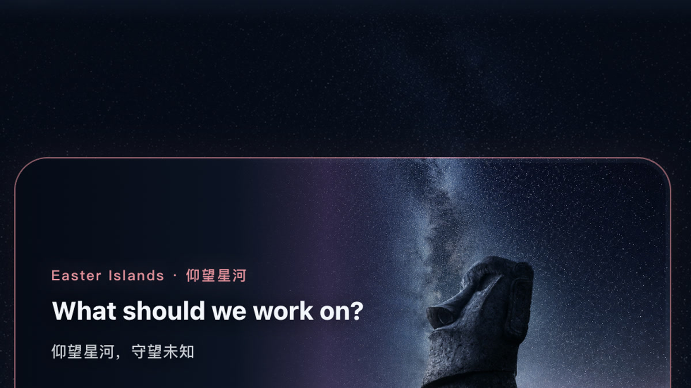 |  |

| 财神驾到 / God of Fortune Arrives | 潮财神 · MONEY / Trendy God of Fortune |
|---|---|
|  | 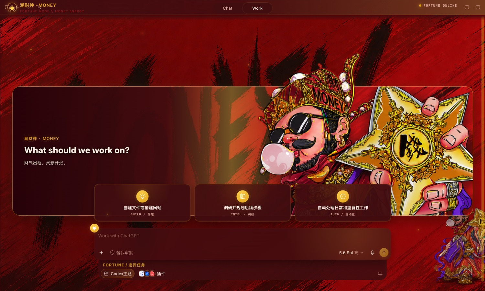 |

| 月下三刀流 / Moonlit Three-Sword Style | 霓虹镜驰 / Neon Drift |
|---|---|
| 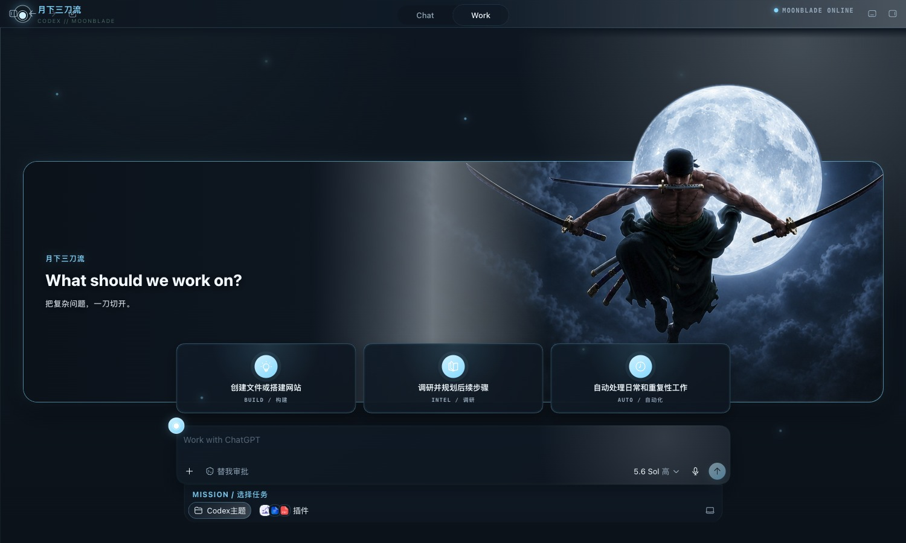 | 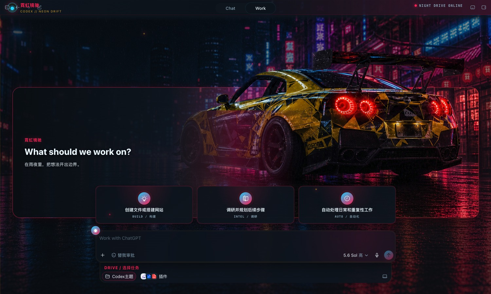 |

| 霓虹仰望 / Neon Reverie | SHE · 银夜花域 / Silver Night Garden |
|---|---|
| 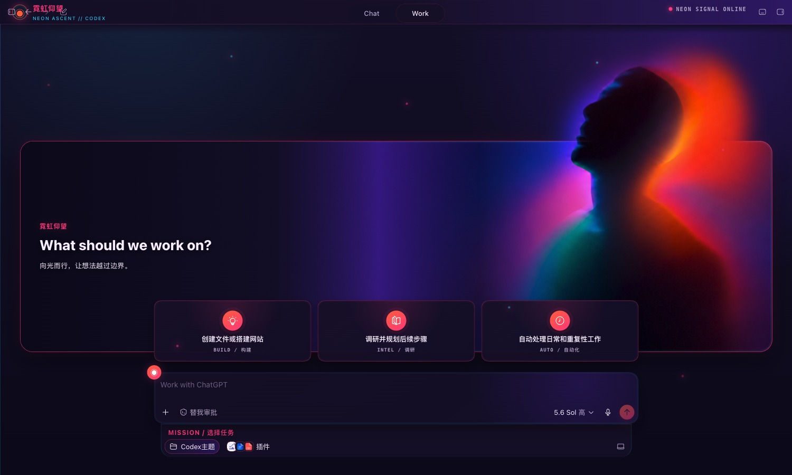 | 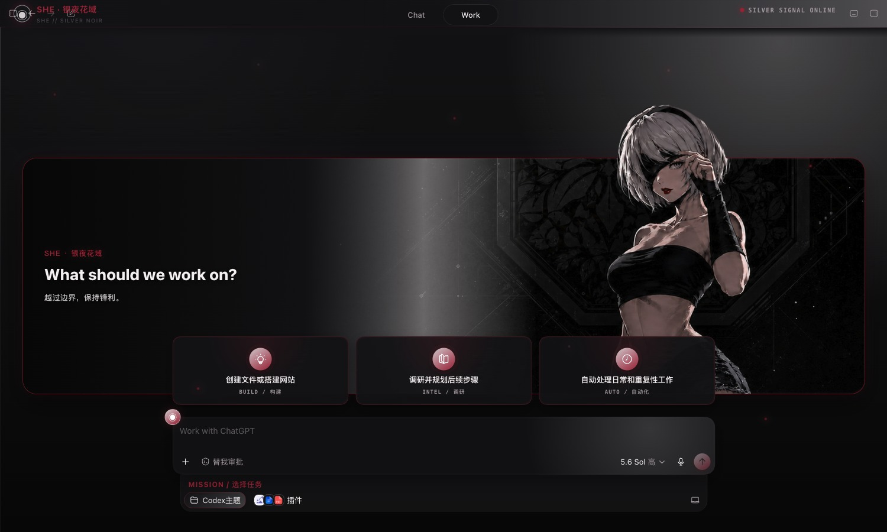 |

| Claude 原生 / Claude Native | 禅静 / Zen Stillness |
|---|---|
| 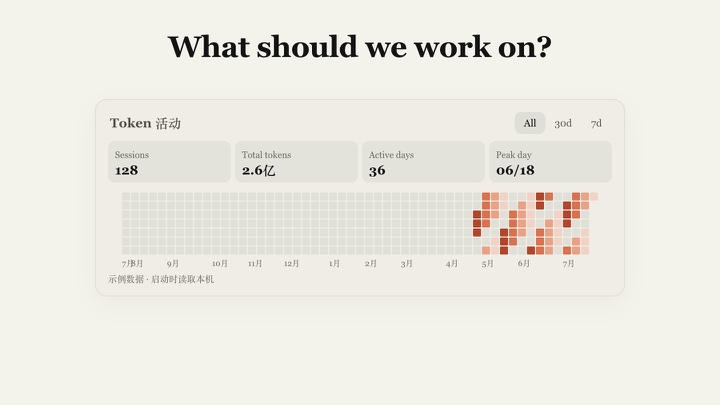 | 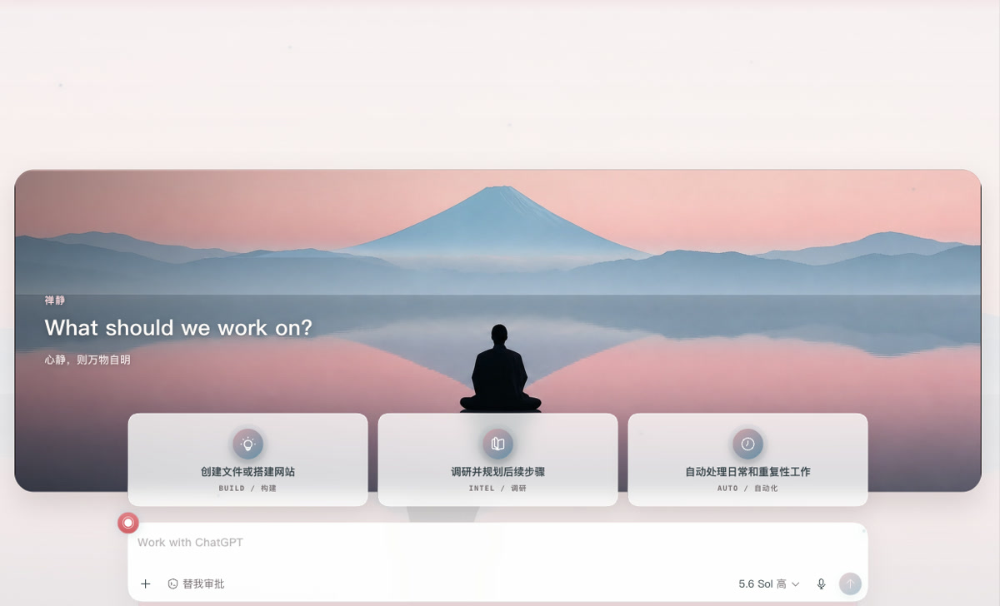 |

## 下载与安装

1. 安装并至少启动一次官方 Codex macOS 桌面端。
2. 从 [Releases](https://github.com/Raven7979/Leili-Codex-Skin/releases/latest) 下载 `Leili-Codex-Skin-1.2.7.zip`。
3. 解压后双击“安装 Leili Codex Skin.command”；首次运行若被 macOS 拦截，请右键选择“打开”。
4. 打开 `Leili Codex Skin.app`，在“雷厉的主题中心”选择主题并点击“应用主题”。
5. 点击“启动主题版 Codex”进入主题界面；需要退出时点击“恢复官方界面”。

“验证主题”会检查当前主题并生成验证截图。“检查主题更新”可以立即读取 GitHub 上的新主题版本。

支持 macOS 12 及以上版本。APP 使用官方 Codex 自带的签名 Node.js，不捆绑官方应用或运行时。

## 自制主题

最简单的方法是在 APP 中点击“自定义图片”，选择一张横向图片并为主题命名；保存后点击“刷新列表”，即可应用自己的主题。建议使用宽度 2000px 以上的横图，以获得更好的自适应效果。

皮肤会持续更新。如果你有想制作的主题、人物或风格，可以在 [Issues](https://github.com/Raven7979/Leili-Codex-Skin/issues) 告诉我。

## 主题更新与安全

APP 启动后会定期检查 GitHub 更新清单；发现新主题时显示界面提示和 macOS 通知。下载包必须同时通过 GitHub HTTPS、文件大小、SHA-256、ZIP 路径和主题结构检查，才会写入本机主题库；被替换的旧主题会自动备份。

## 隐私

- 主题中心仅监听 `127.0.0.1`，操作接口由随机本地令牌保护。
- APP 不上传对话、侧边栏、项目名称、文件路径或截图。
- 网络请求仅用于读取本仓库的更新清单和下载发布包。
- 本仓库只包含发布必需文件和专门制作的无私人内容预览图。

---

## English

Leili Codex Skin is a local theme center for the Codex macOS desktop app. It lets you browse, apply, verify, restore, and create themes, with update notifications when new theme packs are published on GitHub.

The download currently includes 17 themes. The 16 public previews above were captured from the live Codex interface with the sidebar genuinely collapsed and checked for private conversations, project names, and file paths. The Claude Native statistics preview uses clearly labeled sample data.

> This is an unofficial project and is not affiliated with, sponsored by, or endorsed by OpenAI. It does not modify the official `app.asar`. Themes are applied locally through a loopback service and can be removed at any time.

### Install and use

1. Install and launch the official Codex macOS app at least once.
2. Download `Leili-Codex-Skin-1.2.7.zip` from [Releases](https://github.com/Raven7979/Leili-Codex-Skin/releases/latest).
3. Unzip it and double-click `安装 Leili Codex Skin.command`. If macOS blocks it, right-click and choose **Open**.
4. Open `Leili Codex Skin.app`, choose a theme, and click **应用主题 / Apply Theme**.
5. Click **启动主题版 Codex / Launch Themed Codex**. Use **恢复官方界面 / Restore Official UI** whenever you want to return to the original interface.

Use **验证主题 / Verify Theme** to validate the active theme and create a verification screenshot. Use **检查主题更新 / Check Theme Updates** to check GitHub immediately.

macOS 12 or later is supported. The app uses the signed Node.js runtime bundled with the official Codex app and does not redistribute the official app or runtime.

The interface follows the macOS system language automatically. You can also switch languages at any time with the `中文 / EN` button at the top.

### Version 1.2.7 animation highlights

Version `1.2.7` adds looping, theme-matched companions to the upper-right corner of the composer, with motion designed around each theme:

- Characters use small grounded actions instead of floating, with no sweeping backlight behind them. Akatsuki uses a cloak-like stance, Chaos Spark makes a subtle side gesture, the reading cat leans into its book, Cyber Oracle looks upward, the two fortune gods bow or wave, Messi kisses the trophy, the three-sword character slashes, and SHE shifts pose.
- The Easter Islands statue slowly raises and lowers its head; Zen breathes in meditation with a soft expanding ripple; the Claude pixel pet blinks and steps.
- The black hole stays fixed while its highlight circles the event horizon. Neon Drift keeps the full car visible and adds restrained engine vibration and speed lines.
- Every motion loops automatically and respects macOS Reduce Motion. The model-level slider track, dots, and thumb also inherit the active theme palette.
- Ink Mountains, Neon Reverie, and Cyberpunk Blue Night Watch intentionally remain companion-free.

Animated companions are an engine feature. Download and install the `1.2.7` app for the complete update; installing only the theme pack does not upgrade an older engine.

Version `1.2.3` adds the warm Claude Native theme with local token activity, `All / 30d / 7d` filters, per-day hover details, and an animated pixel pet. Statistics are read only when the skin starts or is reapplied; conversation content is never uploaded, and the public preview uses sample data.

Version `1.2.2` adds adaptive layouts for tall displays such as 2560×1440. The hero grows with the available height while cards and the composer remain in the primary visual field; 1080p and compact layouts are unchanged.

### Create your own theme

Click **自定义图片 / Custom Image**, choose a landscape image, and name the theme. Then click **刷新列表 / Refresh List** and apply it. A landscape image at least 2000px wide is recommended for better responsive results.

More skins are coming. If you have a character, visual style, or theme you would like to see, tell me in [Issues](https://github.com/Raven7979/Leili-Codex-Skin/issues).

### Updates, security, and privacy

The app periodically checks the GitHub manifest and can notify you when a new theme pack is available. Every download is verified by trusted GitHub HTTPS hosts, declared and actual size, SHA-256, ZIP path safety, and theme structure before installation. Replaced themes are backed up automatically.

The theme center listens only on `127.0.0.1` and protects actions with a random local token. It does not upload conversations, sidebar content, project names, file paths, or screenshots. Network access is used only to read this repository's update manifest and download release assets.

## License notice

The runtime components are based on MIT-licensed Codex Dream Skin Studio code. Theme images, characters, trademarks, and third-party assets are not covered by that software license. See [NOTICE.md](NOTICE.md).
